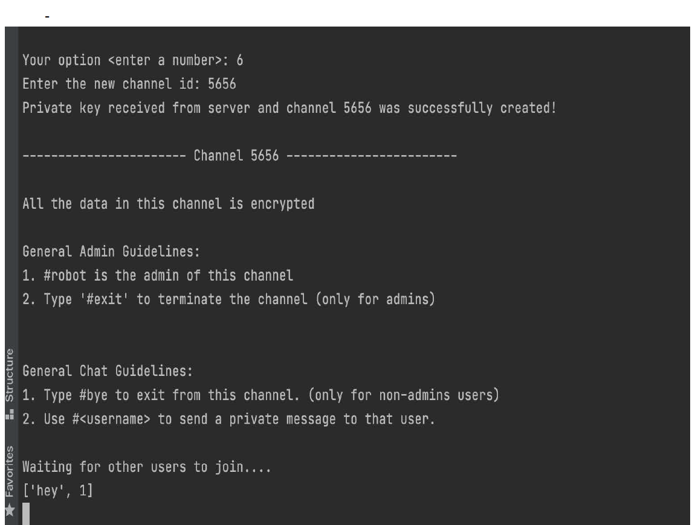
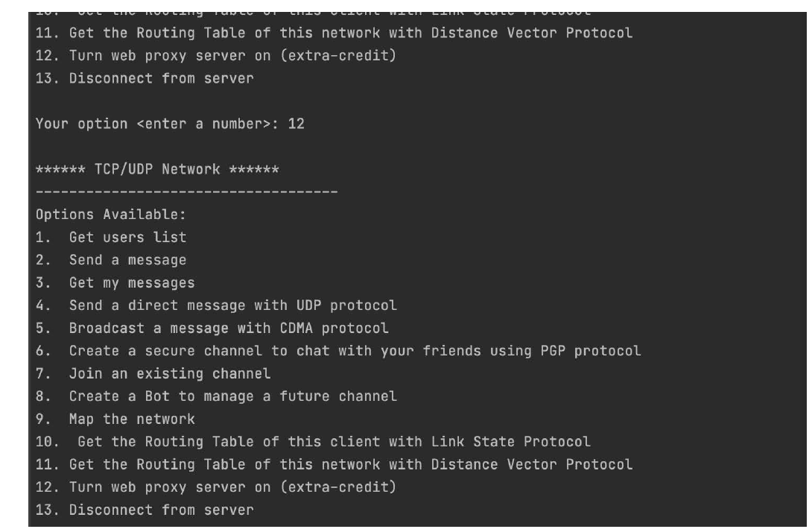
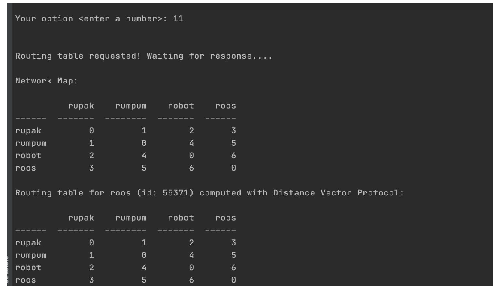
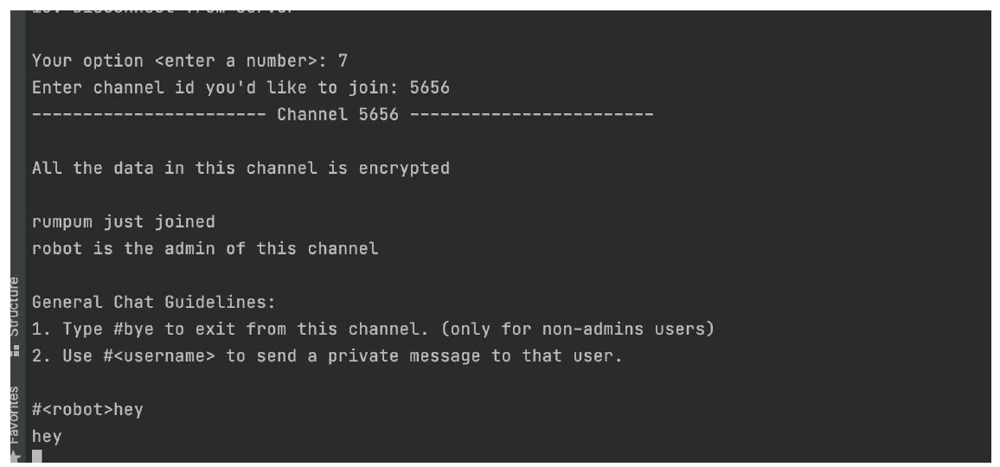
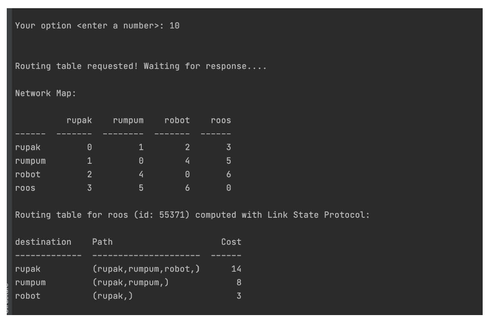
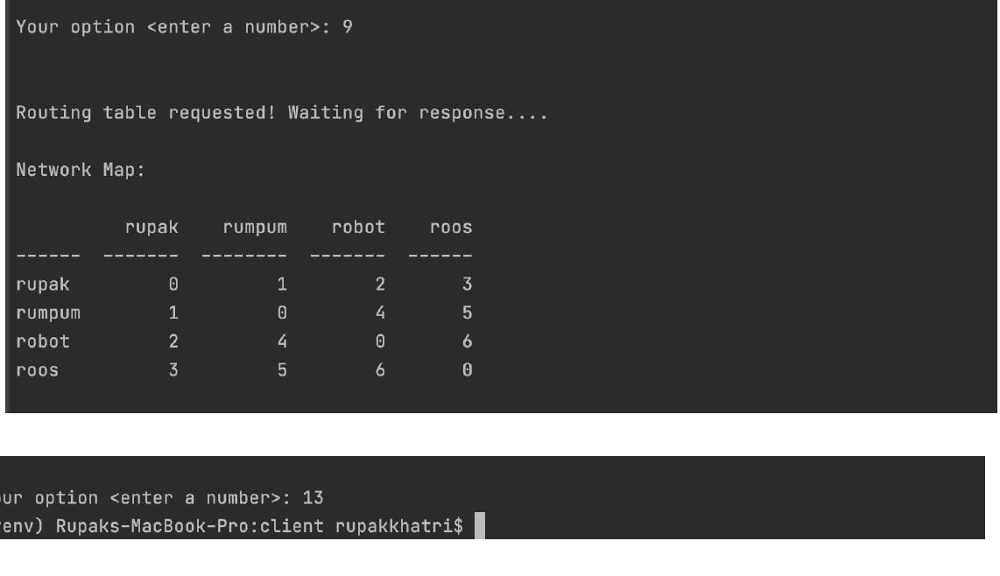

# TCP-UDP-Client-Server-Network-App

•	Build TCP/UDP Server-Client architecture network to provide basic services to multiple clients. 
•	User can Send or receive message using either TCP/UDP and map the connected network  
•	Service was built with Python 

ScreenShot Of the project

  
  
 
  
 
